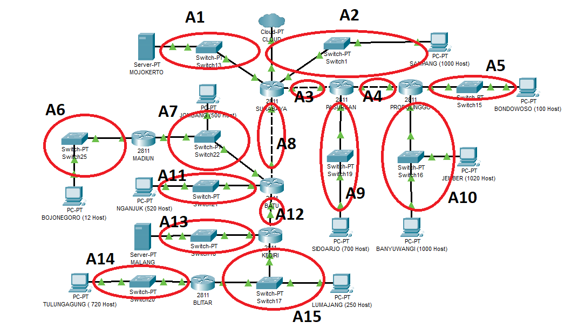
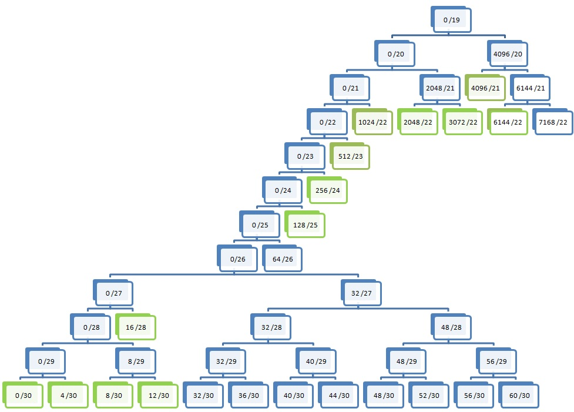

# Jarkom_Modul4_LaporanResmi_B01

## Subnetting & Routing

Soal :


 
Hasil subnetting :



#### VLSM


```
SUBNET	JUM IP	SUBMASK	addresses	no di tree	NID	netmask	Broadcast ID
A10	2023	/21	2048	4096 /21	192.168.16.0	255.255.248.0	192.168.23.255
A2	1002	/22	1024	1024 /22	192.168.4.0	255.255.252.0	192.168.7.255
A9	702	/22	1024	2048 /22	192.168.8.0	255.255.252.0	192.168.11.255
A11	522	/22	1024	3072 /22	192.168.12.0	255.255.252.0	192.168.15.255
A14	722	/22	1024	6144 /22	192.168.24.0	255.255.252.0	192.168.27.255
A7	503	/23	512	512 /23	192.168.2.0	255.255.254.0	192.168.3.255
A15	253	/24	256	256 /24	192.168.1.0	255.255.255.0	192.168.1.255
A5	102	/25	128	128 /25	192.168.0.128	255.255.255.128	192.168.0.255
A6	14	/28	16	16 /28	192.168.0.16	255.255.255.240	192.168.0.31
A3	2	/30	4	12 '/30	192.168.0.12	255.255.255.252	192.168.0.15
A4	2	/30	4	8 '/30	192.168.0.8	255.255.255.252	192.168.0.11
A8	2	/30	4	4 '/30	192.168.0.4	255.255.255.252	192.168.0.7
A12	2	/30	4	0 /30	192.168.0.0	255.255.255.252	192.168.0.3
A1	server mojo	/30	4		10.151.83.20	255.255.255.252	10.151.83.23
A13	server malang	/30	4		10.151.83.16	255.255.255.252	10.151.83.19
TOTAL	5851	/19				
```
