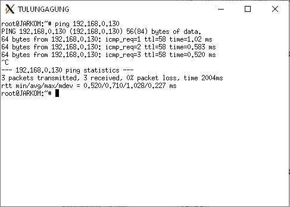

# Jarkom_Modul4_LaporanResmi_B01

## Subnetting & Routing

Soal :


 
Hasil subnetting :


#### A. VLSM

Perhitungan:


Configurasi interfaces di UML:

SURABAYA 
```
auto eth0
iface eth0 inet static
address 10.151.74.10
netmask 255.255.255.252
gateway 10.151.74.9

auto eth1
iface eth1 inet static
address 192.168.4.1
netmask 255.255.252.0

auto eth2
iface eth2 inet static
address 192.168.0.13
netmask 255.255.255.252

auto eth3
iface eth3 inet static
address 192.168.0.5
netmask 255.255.255.252

auto eth4
iface eth4 inet static
address 10.151.83.17
netmask 255.255.255.252
```

MOJOKERTO
```
auto eth0
iface eth0 inet static
address 10.151.83.22
netmask 255.255.255.252
gateway 10.151.83.21
```

SAMPANG
```
auto eth0
iface eth0 inet static
address 192.168.4.2
netmask 255.255.252.0
gateway 192.168.4.1
```

PASURUAN
```
auto eth0
iface eth0 inet static
address 192.168.0.14
netmask 255.255.255.252
gateway 192.168.0.13

auto eth1
iface eth1 inet static
address 192.168.0.9
netmask 255.255.255.252

auto eth2
iface eth2 inet static
address 192.168.8.1
netmask 255.255.252.0
```

SIDORJO
```
auto eth0
iface eth0 inet static
address 192.168.8.2
netmask 255.255.252.0
gateway 192.168.8.1
```

PROBOLINGGO 
```
auto eth0
iface eth0 inet static
address 192.168.0.10
netmask 255.255.255.252
gateway 192.168.0.9

auto eth1
iface eth1 inet static
address 192.168.0.129
netmask 255.255.255.128

auto eth2
iface eth2 inet static
address 192.168.16.1
netmask 255.255.248.0
```

BONDOWOSO 
```
auto eth0
iface eth0 inet static
address 192.168.0.130
netmask 255.255.255.128
gateway 192.168.0.129
```

JEMBER
```
auto eth0
iface eth0 inet static
address 192.168.16.2
netmask 255.255.248.0
gateway 192.168.16.1
```

BANYUWANGI
```
auto eth0
iface eth0 inet static
address 192.168.16.3
netmask 255.255.248.0
gateway 192.168.16.1
```

BATU 
```
auto eth0
iface eth0 inet static
address 192.168.0.6
netmask 255.255.255.252
gateway 192.168.0.5

auto eth1
iface eth1 inet static
address 192.168.0.1
netmask 255.255.255.252

auto eth2
iface eth2 inet static
address 192.168.12.1
netmask 255.255.252.0

auto eth3
iface eth3 inet static
address 192.168.2.1
netmask 255.255.254.0
```

NGANJUK 
```
auto eth0
iface eth0 inet static
address 192.168.12.2
netmask 255.255.252.0
gateway 192.168.12.1
```

JOMBANG
```
auto eth0
iface eth0 inet static
address 192.168.2.2
netmask 255.255.254.0
gateway 192.168.2.1
```

MADIUN
```
auto eth0
iface eth0 inet static
address 192.168.2.3
netmask 255.255.254.0
gateway 192.168.2.1

auto eth1
iface eth1 inet static
address 192.168.0.17
netmask 255.255.255.240
```

BOJONEGORO
```
auto eth0
iface eth0 inet static
address 192.168.0.18
netmask 255.255.255.240
gateway 192.168.0.17
```

KEDIRI
```
auto eth0
iface eth0 inet static
address 192.168.0.2
netmask 255.255.255.252
gateway 192.168.0.1

auto eth1
iface eth1 inet static
address 192.168.1.1
netmask 255.255.255.0

auto eth2
iface eth2 inet static
address 10.151.83.16
netmask 255.255.255.252
```

MALANG
```
auto eth0
iface eth0 inet static
address 10.151.83.18
netmask 255.255.255.252
gateway 10.151.83.17
```

LUMAJANG
```
auto eth0
iface eth0 inet static
address 192.168.1.2
netmask 255.255.255.0
gateway 192.168.1.1
```

BLITAR
```
auto eth0
iface eth0 inet static
address 192.168.1.3
netmask 255.255.255.0
gateway 192.168.1.1

auto eth1
iface eth1 inet static
address 192.168.24.1
netmask 255.255.252.0
```

TULUNGGUNG
```
auto eth0
iface eth0 inet static
address 192.168.24.2
netmask 255.255.255.0
gateway 192.168.24.1
```

Routing:

SURABAYA
```
route add -net 192.168.0.8 netmask 255.255.255.252 gw 192.168.0.14
route add -net 192.168.0.128 netmask 255.255.255.128 gw 192.168.0.14
route add -net 192.168.0.16 netmask 255.255.255.240 gw 192.168.0.6
route add -net 192.168.2.0 netmask 255.255.254.0 gw 192.168.0.6
route add -net 192.168.8.0 netmask 255.255.252.0 gw 192.168.0.14
route add -net 192.168.16.0 netmask 255.255.248.0 gw 192.168.0.14
route add -net 192.168.12.0 netmask 255.255.252.0 gw 192.168.0.6
route add -net 192.168.0.0 netmask 255.255.255.252 gw 192.168.0.6
route add -net 192.168.24.0 netmask 255.255.252.0 gw 192.168.0.6
route add -net 192.168.1.0 netmask 255.255.255.0 gw 192.168.0.6
route add -net 10.151.83.16 netmask 255.255.255.252 gw 192.168.0.6
```

PASURUAN
```
route add -net 192.168.0.128 netmask 255.255.255.128 gw 192.168.0.10
route add -net 192.168.16.0 netmask 255.255.248.0 gw 192.168.0.10
route add -net 0.0.0.0 netmask 0.0.0.0 gw 192.168.0.13
```

PROBOLINGGO
```
route add -net 0.0.0.0 netmask 0.0.0.0 gw 192.168.0.9
```

BATU
```
route add -net 0.0.0.0 netmask 0.0.0.0 gw 192.168.0.5
route add -net 192.168.0.16 netmask 255.255.255.240 gw 192.168.2.3
route add -net 192.168.24.0 netmask 255.255.252.0 gw 192.168.0.2
route add -net 192.168.1.0 netmask 255.255.255.0 gw 192.168.0.2
route add -net 10.151.83.16 netmask 255.255.255.252 gw 192.168.0.2
```

MADIUN
```
route add -net 0.0.0.0 netmask 0.0.0.0 gw 192.168.2.1
```

KEDIRI
```
route add -net 0.0.0.0 netmask 0.0.0.0 gw 192.168.0.1
route add -net 192.168.24.0 netmask 255.255.252.0 gw 192.168.1.3
```

BLITAR
```
route add -net 0.0.0.0 netmask 0.0.0.0 gw 192.168.1.1
```


Tes ping

Ping MOJOKERTO dari MALANG (Server - server)


Ping BONDOWOSO dari TULUNGAGUNG (client - client)



Ping SAMPANG dari MALANG (client - server)


Ping its.ac.id (ping keluar)


#### B. CIDR

Hasil subnetting:


Set-up CPT:


Routing:


